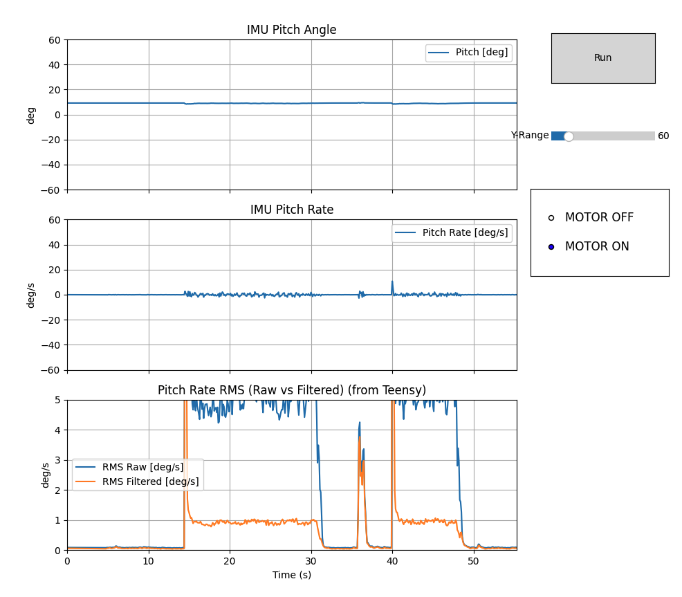

# TWR Testing

The starting code here reflects the work done in can_testing. There were a lot of issues to improving CAN communications. This also reflects use of the brain_board V1.6 which has two separate CAN transceivers. 

Deets:
- Github repo: `https://github.com/davidmolony/MESC_Firmware.git`
- Branch: `RTOS_REMOVAL`
- Folder: `can_testing`
- Commit: `37bc92fb2ed2a5541fa8c1162a954772b4dffe05`
- Short hash: `37bc92f`

## CAN Testing Status (Current)

- Two physical CAN buses on brain_board V1.6 are working and receiving telemetry from both ESCs.
- 30s/60s validation runs complete reliably with `TX fail = 0` and `rx_overflow = 0`.
- End-to-end reliability improved substantially versus early shared-bus tests.
- Stable operation was demonstrated at:
  - `tx hz 250` (strong margin)
  - `tx hz 500` (usable in latest setup, but with tighter margin)
- ESC telemetry scheduling with aligned phase (`can_posvel_phase_us = 0` on both ESCs) produced better symmetry and consistency in recent tests.
- Remaining behavior to keep in mind:
  - IQREQ timing from Teensy is not perfectly uniform (mixed ~2-3 ms spacing under current loop/service pattern).
  - Telemetry quality is still evaluated by tail metrics (p95/p99/max gap), not average gap alone.
- Current conclusion: CAN telemetry/command path is in a good state for balance bring-up testing.

## IMU Filtering Algorithms (Current)

- Sensor and timing path:
  - ICM42688 is read over SPI using DRDY interrupt signaling.
  - Each DRDY event triggers `getAGT()` in the main loop.
  - If `getAGT()` fails, IMU state is marked invalid for that cycle (`imu_valid = 0`).
- Orientation estimator:
  - 6-DOF Mahony quaternion update (gyro integration + accel gravity correction).
  - Proportional/integral feedback gains are `Kp = 0.5`, `Ki = 0.1` (implemented as `twoKp = 1.0`, `twoKi = 0.2`).
- Accel gating:
  - Accelerometer vector is normalized.
  - Gravity correction is applied only when accel magnitude is near 1 g (`0.85 g` to `1.15 g`).
  - Outside this range, accel correction is ignored for that step (gyro-only propagation, integral reset).
- `dt` handling for filter stability:
  - `dt` is measured from IMU update timestamps.
  - If out of expected bounds (`<0.5 ms` or `>5 ms`), it falls back to the nominal control period (`1 ms`).
- Output states used by control/diagnostics:
  - Pitch angle is extracted from quaternion: `pitch_rad = asin(2*(q0*q2 - q3*q1))`.
  - Raw pitch rate uses gyro Y axis in rad/s (`pitch_rate_raw`).
  - Filtered pitch rate uses a first-order IIR low-pass:
    - `pitch_rate = alpha * pitch_rate_raw + (1 - alpha) * pitch_rate_prev`
    - Current `alpha = 0.15`.
- RMS diagnostics in `verify_angle` mode:
  - `rms_raw_rad_s` and `rms_filt_rad_s` are rolling RMS values over a fixed 200-sample window (not cumulative).
  - This provides fast settling and better live vibration/noise assessment during motor on/off tests.

## IMU Testing

### Serial fields sent by Teensy (`VERIFY_ANGLE`)

- `cmd`: message type (`"VERIFY_ANGLE"`).
- `t`: Teensy timestamp in microseconds.
- `pitch_rad`, `pitch_deg`: current estimated pitch angle.
- `pitch_rate_raw_rad_s`, `pitch_rate_raw_deg_s`: raw gyro-derived pitch rate.
- `pitch_rate_rad_s`, `pitch_rate_deg_s`: filtered pitch rate (IIR filtered).
- `rms_raw_rad_s`: rolling RMS of raw pitch rate (200-sample window).
- `rms_filt_rad_s`: rolling RMS of filtered pitch rate (200-sample window).
- `rms_n`: number of samples currently in RMS window (ramps to 200, then stays at 200).
- `motor`: `0/1` indicating whether motor command mode is active in verify mode.
- `tau_left_nm`, `tau_right_nm`: verify-mode motor torques when `motor=1`.
- `imu_valid`: `1` if IMU update is valid for current cycle.
- `imu_age_us`: age of last IMU update in microseconds.
- `loop_dt_us`: control loop dt in microseconds.

### What each graph shows in `IMU_test.py`

- Top graph (`IMU Pitch Angle`): `pitch_deg` vs time.
- Middle graph (`IMU Pitch Rate`): `pitch_rate_deg_s` (filtered pitch rate) vs time.
- Bottom graph (`Pitch Rate RMS (Raw vs Filtered)`):
  - Blue line: raw RMS (`rms_raw_rad_s` converted to deg/s).
  - Orange line: filtered RMS (`rms_filt_rad_s` converted to deg/s).

### How to run the Python test tool

```bash
python3 /Users/owhite/balancing-robot-notes/teensy40/TWR/IMU_test.py \
  -p /dev/cu.usbmodemXXXX \
  -b 921600 \
  --expect-n 200
```

- Click `Run` to start `verify_angle` telemetry mode.
- Use motor mode selector (`MOTOR OFF` / `MOTOR ON`) to choose whether `Run` commands motor toggle or plain verify mode.

### IMU Plot Image


Plot shows motors  running from 15-30s, a bump on the table, and running motors at 40-50s

## Control Sign Issue (Open)

- During balance bring-up, we observed behavior consistent with a possible mis-signed translational contribution in the control law (most likely in `x` and/or `x_dot` terms), while tilt-related terms appeared mostly directionally correct.
- Symptom pattern:
  - The robot can momentarily stabilize near tare.
  - It then develops drift and sometimes applies torque that appears to reinforce translational error instead of damping it.
- Practical implication:
  - Before integrating RC references, we should re-validate sign conventions for wheel unwrap, `x`, `x_dot`, and wheel torque mixing (`tau_L`, `tau_R`) under a controlled test sequence.
