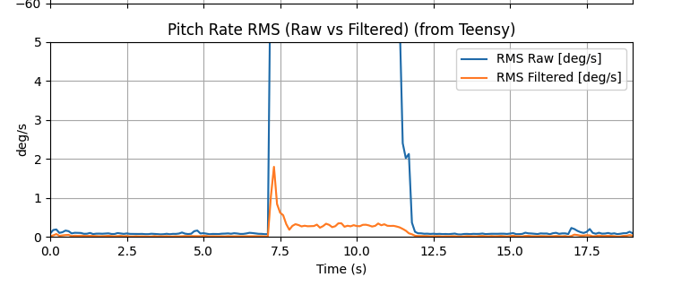
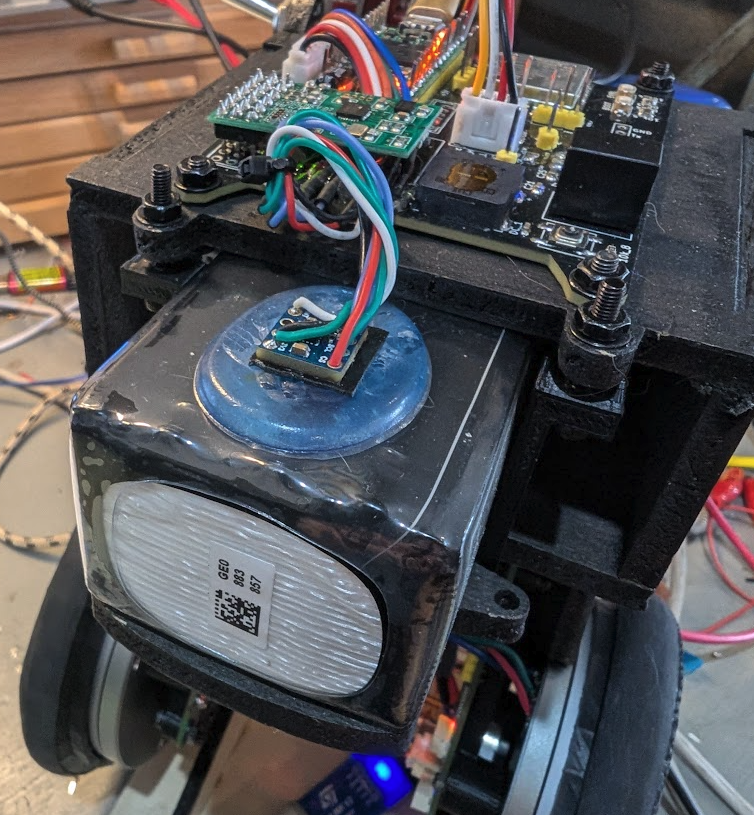

# Preamble

Unless you address noise and vibration in the tilt detection system of your bot, you dont have a balancing robot, you have a vibration-amplifying chaos machine.

A balancing robot is fundamentally a noise-sensitive inverted pendulum. If tilt estimate quality degrades, the controller will:
- Inject torque proportional to measurement noise
- Amplify high-frequency vibration
- Cycle into failure mode

## Previous work
- See [this entry](../../DOCS/nov16_IMU.md) on using a Mahony filter to improve readings from the ICM42688. The filter automatically rejects vibration-induced accelerometer noise and uses gyro bias correction to keep the angle accurate over time. 
- Code used for SPI communications with the ICM42688 was slightly modified from [here](https://github.com/finani/ICM42688.git) and the Mahony filter in [supervisor.cpp](src/supervisor.cpp) in `mahonyUpdateIMU()`. 
- Also have a look at `controlLoop()` in [balance_TWR_mode.cpp](src/balance_TWR_mode.cpp)

## Things to test:
- Quantify the noise the motor injects into the IMU
- Mechanical isolation (moongel!)
- Location / mounting of IMU that impact vibration
- Verify IMU reports correct angle vs. actual mechanical tilt (see: [this](../../DOCS/nov16_IMU.md))
- Mahony fusion filters
- Low-pass filters
- RMS quantification
- Live plotting

## IMU noise
During the process comparing the IMU with the mechanical angle of the wheel encoders I tested this

I put this in the code:
```
    float a_mag = sqrtf(ax*ax + ay*ay + az*az);
    Serial.printf("a_mag=%.5f\r\n", a_mag);
```

Before any filter, and when the motor is running, I get these type of values: 
```
a_mag=3.05135
a_mag=5.25944
a_mag=3.85885
a_mag=6.80106
a_mag=3.69635
a_mag=5.77368
a_mag=9.36287
a_mag=10.89755
a_mag=4.79244
a_mag=2.57672
a_mag=8.32236
a_mag=1.29584
a_mag=2.59398
```

That is a **horrendous** level of noise. 

To follow the status of vibration reduction:
- `./plot_amag.py -p /dev/cu.usbmodem178888901`
- `./IMU_test.py -p /dev/cu.usbmodem178888901` 

**Sensor fusion gating**

```c
  if (accMag > 1e-6f) {
    float recip = 1.0f / accMag;
    ax *= recip;
    ay *= recip;
    az *= recip;

    if (accMag > 0.85f && accMag < 1.15f) {
      accelValid = true;
    } else {
      accelValid = false;
    }
  }
```

- Takes `a_mag` to < 2
- By no means noise free
- accel + gyro if vibrations are at a dull roar. 
- When accelValid goes false often, you'll see major problems with drift
- It's not a filter, but basically says: "Only trust the accelerometer if total acceleration ≈ 1 g"
- Referred to as sensor fusion gating

**Gyro low-pass filter**

Applies a Mahony filter which fuses acceleration and gyro values from the IMU. 


```
      const float rate_alpha = 0.03f; // LPF against vibration
      float pitch_rate =
          rate_alpha * pitch_rate_raw +
          (1.0f - rate_alpha) * sup->imu.pitch_rate;
```
Is a first-order low-pass filter

**mahonyUpdateIMU()**

- Fuses the gyro + accelerometer and serves as a state observer filter
- Normalizes accelerometer
- Computes gravity direction error
- Applies proportional + integral correction
- Integrates gyro into quaternion
- Renormalizes quaternion

**Gathering noise metrics**

```c
struct RunningStats {
  uint32_t n = 0;
  float mean = 0.0f;
  float m2 = 0.0f;

  void reset() { n = 0; mean = 0.0f; m2 = 0.0f; }
  void push(float x) {
    n++;
    float d = x - mean;
    mean += d / (float)n;
    float d2 = x - mean;
    m2 += d * d2;
  }
  float variance() const { return (n > 1) ? (m2 / (float)(n - 1)) : 0.0f; }
  float stddev() const { return sqrtf(variance()); }
};
```

Not a filter but basically serves as a noise metric that measures the standard deviation of the pitch rate over the window since last reset. Let's have a look at a plot where we have put all these mitigating factors in place and the run one of the motors. The plot shows the RMS of filtered versus unfiltered data during that run. What is gratifying is there is an initial spike in the fitered angle measurement that settles down very quickly even when the motor is running. 



**Noise mitigation on the bot:**
- Designed battery isolation into frame
- Used moongel pad on battery
- Used 3M VHB tape to moongel
- See pic. An IMU module on blue blob; vibration stabilized system



**Where we're at now:**
- Stationary RMS well below 0.1 deg/s
- Raw spikes only during table impact (banging fist on table)
- Filtered rate very clean
- Table impact spikes ~4 deg/s raw
- No sustained noise bursts

| Metric                   | Status          |
| ------------------------ | --------------- |
| IMU data ready interrupt | Working         |
| Mahony filter            | Working         |
| Pitch extraction         | Working         |
| Pitch rate LPF           | Working         |
| Running RMS              | Working         |
| Control loop timing      | Stable (~21 µs) |
| Overruns                 | None            |
| Telemetry decimation     | Working         |

This is excellent performance.

This work was done at this commit: hash id: `OUT OF DATE 9633b44677406c790000eb56cd1858c216e7f7b5`
